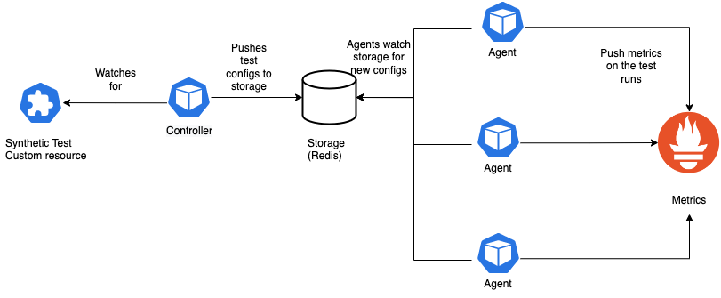
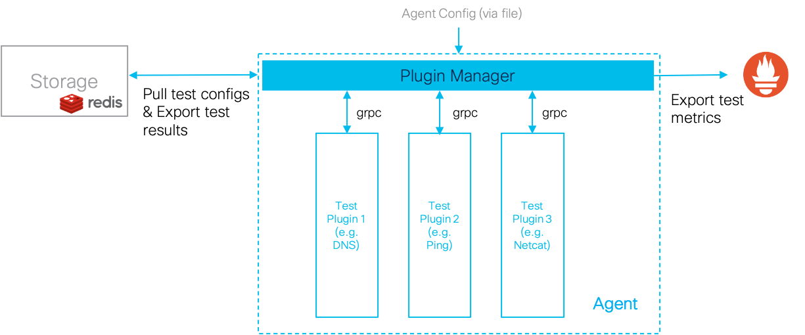
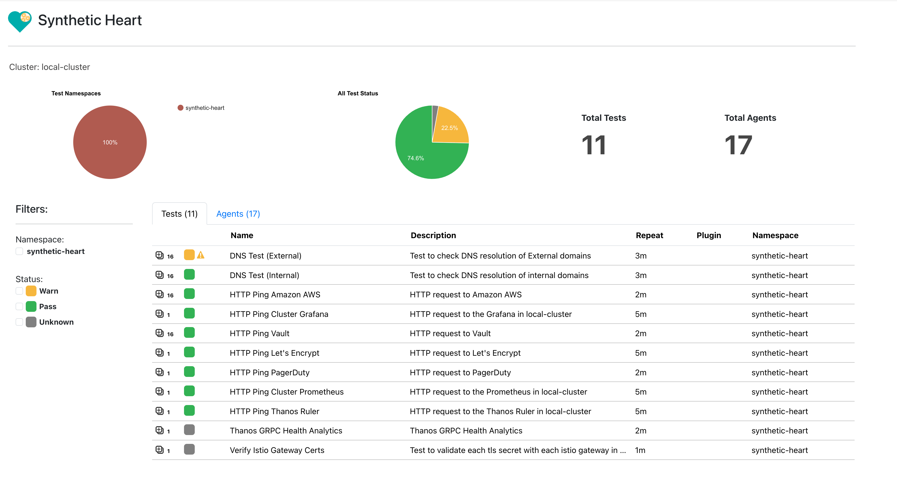

## Synthetic Heart - Kubernetes synthetic testing and monitoring framework

Synthetic Heart is a synthetic testing and monitoring framework for Kubernetes clusters.  It allows operators to run synthetic tests, then check and monitor the results through an API or through metrics (via Prometheus).

## Architecture

Synthetic Heart is comprised of four components:

- [Agent](./agent): Runs the actual tests, watches redis/kv-store for test configs
- [Rest api](./restapi): To query test results, logs and agent details
- [Controller](./controller): K8s controller (watches for SyntheticTest CRD), and stores them in redis for agents to pick up/query
- Redis (storage): To store test results and also synthetic tests



### The controller

The controller is a Kubernetes controller that watches the cluster for `SyntheticTest` CRDs. It mirrors the config in the CRDs to storage (i.e. Redis). It runs a reconcile loop whenever the CRDs change or if there are any redis events such as agent (un)registration events (in order to reschedule tests if an agent exits). Finally, It performs a periodic cleanup of the storage to remove any stale agents or tests.

#### Example CRD

```yaml
apiVersion: synheart.infra.webex.com/v1
kind: SyntheticTest
metadata:
  name: aws-health-check      # name of the test - must be unique
spec:
  plugin: httpPing            # which plugin to run
  node: "$"                   # which nodes run the test '$'=any node (e.g. 'k8snode*', '*')
  displayName: HTTP Ping AWS  # name to be displayed in the UI
  description: HTTP request to the Amazon AWS 
  timeouts:
    run: 1m    # time after which the test is considered failed, and the plugin is restarted
  repeat: 2m   # how often to repeat the test
  config: |    # config for the plugin
    address: https://console.aws.amazon.com
    expectedCodeRegex: ^(200|302){1}
    retries: 3
```

#### Synthetic-test spec functionality

Node selection:

- `node: *`
  - Run on all nodes
- `node: worker*`
  - Run on all nodes with the prefix 'worker'
- `node: $`
  - Run on a single (random) node
- `node: worker$`
  - Run on a single node with the prefix 'worker'

### The Agent



The Agent is responsible for watching the storage (Redis) for any new or updated test configs, and running them.

There are three main components in the agent:

- Plugin Manager - responsible for managing lifecycle of plugins
- Prometheus Exporter - Exports metrics to Prometheus (can use push gateway)
- Plugins - Test logic written as separate binaries/scripts.

The plugin manager is responsible for handling the lifecycle of these plugins. It will start/stop, check health and restart them on crash/error. The plugin manager also exports the test results to redis, as well as metrics to Prometheus.

#### The Plugins

Plugins run the actual tests. They are separate binaries/scripts that are run by the agent.

This is what makes Synthetic Heart extensible. The plugins can be written in any language, as long as they can communicate with the plugin manager via gRPC. Currently only Golang and Python plugins are tested.
The plugins use [hashicorp go-plugins](https://github.com/hashicorp/go-plugin).

## Rest Api

Synthetic Heart also comes with a Rest API which lets external services query test results etc. It is essentially a shim for the Redis storage.

## UI (Experimental)

A UI is currently being worked on. It will allow users to view test results, logs, and agent details. You can check it out the [UI repo here](https://github.com/bakshi41c/synthetic-heart-ui).



## Installation

### With Helm Chart

Easiest way to run synthetic-heart is to install the helm chart in the `charts/` directory.

Prerequisites:

- Kubernetes cluster (Tested with v1.25+, older versions may work)
- [Helm v3](https://helm.sh/docs/intro/install/#helm)

Steps to follow:

- Install the [synthetic-heart](./chart/synthetic-heart) Helm chart
  - Run: `helm upgrade -i synthetic-heart-system -n synthetic-heart-system .` in `charts/` directory.
  - This installs the RestAPI, Agents (as DaemonSet), Controller, and Redis.
- Install the [synthetic-tests](./chart/synthetic-tests) Helm chart
  - Run `helm upgrade -i synthetic-tests  -n synthetic-heart-tests .` in `charts/` directory.
  - This installs two example synthetic tests.
- You may then port forward the rest api to query results.
  - Run `kubectl port-forward svc/synheart-api-svc 8080:8080 -n synthetic-heart`
  - and then query the tests `curl http://localhost:8080/api/v1/test-configs`

### Without Helm Chart

It might be a bit more complex to install the components manually. Please explore the [Helm chart](./chart/synthetic-heart) to check the example configurations for different Kubernetes resources. The dependencies, and major components are described below.

A few Kubernetes resources need to be installed:

- CustomResourceDefinition - The `SyntheticTest` CRD needs to be installed. [Link to CRD.](./controller/config/crd/bases/synheart.infra.webex.com_synthetictests.yaml)
- Redis - Redis v7 needs to be installed so the test configs and results can be stored.
  - A `Service` is also needed, so the redis endpoint can be accessed by agents.
- Controller - Needs to be deployed as a `Deployment`.
  - The controller needs `ServiceAccount`, `ClusteRole`, `ClusterRoleBinding`, allowing it to query and modify `SyntheticTests`.
- Agents - Can be deployed as a `DaemonSet`.
  - The configuration of the agents is passed in as a file. The file should be mounted from a `ConfigMap`
- RestApi - Needs to be deployed as a `Deployment`
  - The configuration of the agents is passed in as a file. The file should be mounted from a `ConfigMap`
  - A `Service` for the Restapi is needed.
  - Optionally an `Ingress` can be added to the Restapi to make the API accessible from outside the cluster.

## Deployment strategies

Please check the [Deployment](./docs/Deployment.md) document for different deployment strategies.

## Credits and Acknowledgements

Thank you to the following folks for contributing to synthetic-heart project:

- Allen Guo: <tiaguo@cisco.com>
- Ben Zhao: <benzhao@cisco.com>
- Cristian Maugeri: <cmaugeri@cisco.com>
- David Hazra: <dahazra@cisco.com>
- Jeff Wang: <jiangfwa@cisco.com>
- Jerry Zhang: <xiaojiez@cisco.com>
- Luke Ren: <lukren@cisco.com>
- Lun Zhou: <lunzhou@cisco.com>
- Meibao Wang: <meibwang@cisco.com>
- Mercion Wilathgamuwage: <mwilathg@cisco.com>
- Shaz Balakumar: <shbalaku@cisco.com>
- Kieran Shave <kshave@cisco.com>

## Roadmap

There's a lot of features that are still being worked on. [Get involved!](./CONTRIBUTING.md)

- UI (currently being worked on)
- ~~Re-design agent deployment model (allow agents per node, per namespace etc.)~~
  ~~- Allow agents to be deployed in different namespace, mount secrets etc.~~
- ~~Python plugins~~
- Agent CRD (to allow for easier agent deployment)
- Plugin versions
- Dynamically add or remove plugins at build time (to reduce binary size)
- More plugins

## Contributing

Please refer to [CONTRIBUTING.md](./CONTRIBUTING.md)

## License

Please refer to [LICENSE](./LICENSE)
