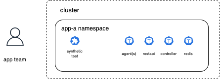
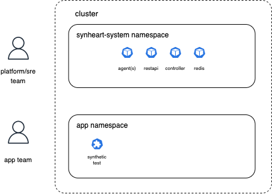
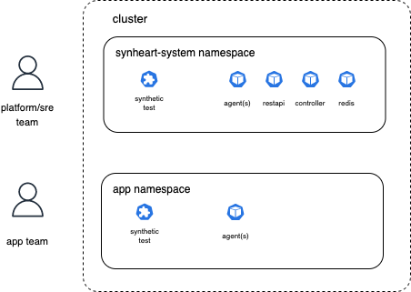

# Deployment strategies

Synthetic-heart can be deployed in a variety of ways. Below are two strategies that have been used:

## Single deployment (all owned by a single team)

This is the simplest way to deploy synthetic-heart. In this deployment, a single team owns:

- the synthetic-heart-system namespace components (controller, restapi, redis)
- the synthetic-heart agents
- the synthetic-tests that run on the agents

## Shared agent deployment

In this deployment:

- **The Platform/SRE team owns:**

  - the synthetic-heart-system namespace components (controller, restapi, redis).
  - the agents (and thus the plugins that come with the agents)

- **The application team owns:**

  - The Synthetic tests that run on the agents.

This deployment is useful when the platform team is responsible for the infrastructure and the application team is responsible for the tests.
The plugins that are available for the Synthetic tests are controlled by the platform team.

## Mixed agent deployment

In this deployment:

- **The Platform/SRE team owns:**

  - the synthetic-heart-system namespace components (controller, restapi, redis).

- **The application team owns:**

  - The agents (and thus the plugins that come with the agents)
  - The Synthetic tests that run on the agents.

This is an extension to the Shared agent deployment mode. In this case, the application team can bring their own agents (therefore their own plugins) and run their own tests.
